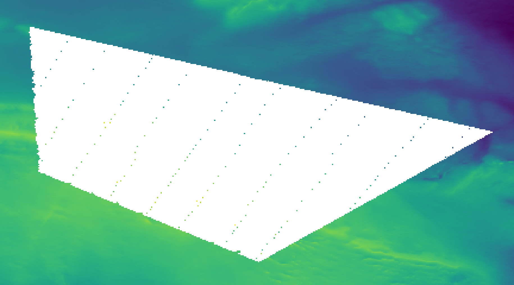
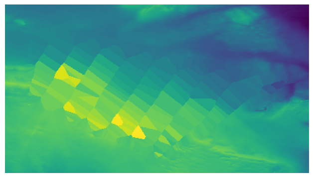
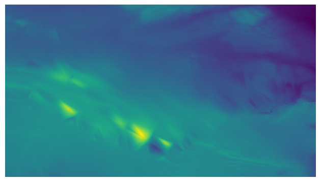
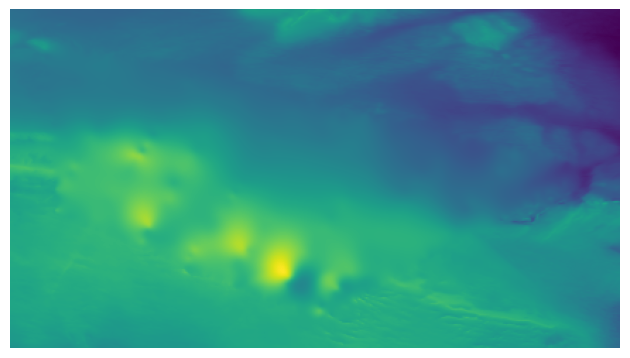
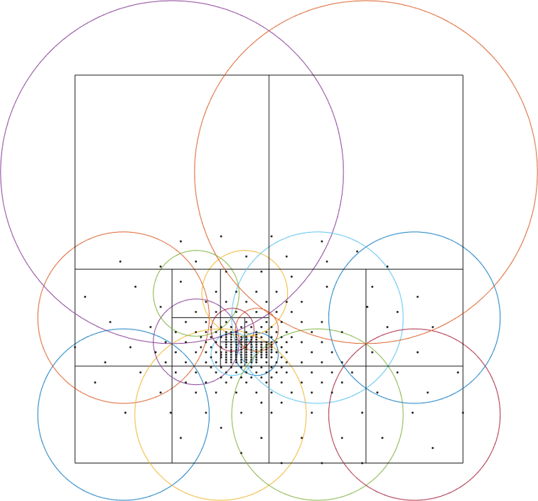
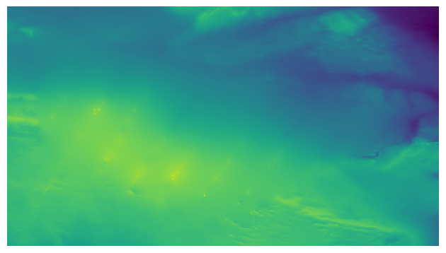
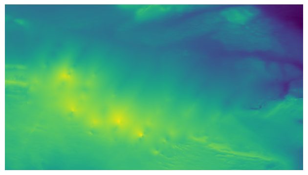
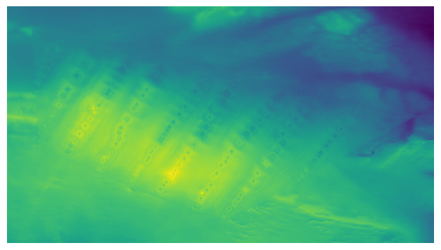

.. _methods:

Interpolation Methods
=====================

"Interpolation" is a broad term. In our case, it consists in obtaining elevation values at cells/points given a set of
known reference elevation data at known locations. However, depending on the sampling/distribution of the input data,
and where do we want to interpolate it, there are several ways of dealing with this problem.

The typical literature for interpolation does not consider any specific distribution for the samples. In this sense,
we find the **Scattered-data interpolators**. These methods work in two steps:

1. Take the known data points as reference to create an *interpolator*.
2. Apply the interpolator at whatever query point you desire. For interpolations on a grid, as in our case, the interpolation is queried at all the grid cells to be interpolated.

However, there are several cases in which the interpolation problem consists in filling "missing data", in the sense of
having continuous and densely-sampled parts of the map that are missing and that we need to fill given the known data surrounding these parts.
In these cases, the problem can be seen as "filling the holes in a coherent way". Obviously, the scattered data
interpolators can be used for this purpose. However, there is a wide literature of methods trying to take advantage of
the "filling" happening on a regular grid. In the computer vision literature, these are called **inpainting** methods.
In this toolbox we use inpainting approaches, usually devised for image processing, to tackle the interpolation problem
on elevation grids. As mentioned above, these methods only work on the regular grids, but provide the advantage of
providing **higher-degree** approximations **faster** than some similar approaches in the scattered area,
and require **much less memory** to execute (the solver we implement just applies convolution operations on the input grid).

In the following sections, for each of the methods in the package, we will briefly describe their behaviour,
list the parameters available to tune in each case, provide the data/cases for which a given method is more suitable,
and list their pros/cons.

In addition, in order to get a qualitative evaluation of the behaviour of each method, we will run them with default
parameters on the following dataset:

    Example dataset. Colored areas and points represent the known reference elevation data, while the area to interpolate is shown in white. Data by courtesy of the Swedish Maritime Administration

Note that this dataset mixes both a scattered and densely-sampled reference data.

.. _scattered_methods:

Scattered data Interpolators
****************************

Nearest Neighbors
-----------------

    Example dataset interpolated using the Nearest Neighbors interpolant (*nearest* option  in ``interpolate_netcdf4.py``).

Each cell to interpolate gets its value from the nearest reference cell.

This method is just an interphase for the `scipy.interpolate.NearestNDInterpolator <https://docs.scipy.org/doc/scipy/reference/generated/scipy.interpolate.NearestNDInterpolator.html>`_.

Parameters
++++++++++

* ``--rescale`` (flag): Rescales the points to the unit cube before performing the interpolation.

Suitable for
++++++++++++

* Quick initialization of the interpolation using PDE inpainters (see sections below).
* Quick large-area interpolation.

Advantages
++++++++++

* Fastest interpolator.
* As opposed to the other two fast scattered data interpolation methods (*linear* and *cubic*), it can interpolate outside of the convex hull of the reference data.

Disadvantages
+++++++++++++

* Results look *blocky*, as many points get the same elevation value.

Linear
------

.. figure:: images/linear.png
    :width: 500
    :align: center

    Example dataset interpolated using the Linear interpolant (*linear* option in ``interpolate_netcdf4.py``).

Creates a linear interpolant by creating a 2D Delaunay triangulation using the reference data points.
Upon a given query point, it searches in which of the triangle in the XY plane it falls, and computes a barycentric interpolation of the elevation using the reference values at the vertices of the triangle.

This method is just an interphase for the `scipy.interpolate.LinearNDInterpolator <https://docs.scipy.org/doc/scipy/reference/generated/scipy.interpolate.LinearNDInterpolator.html>`_.

Parameters
++++++++++

* ``--rescale`` (flag): Rescales the points to the unit cube before performing the interpolation.
* ``--fill_value`` (float): Value used to fill in for requested points outside of the convex hull of the input points. If not provided, the default is NaN.

Suitable for
++++++++++++

* Quick large-area interpolation.

Advantages
++++++++++

* Provides a smoother interpolation than the *linear* method at a similar computational cost.

Disadvantages
+++++++++++++

Cubic
-----

    Example dataset interpolated using the Cubic interpolant (*cubic* option in ``interpolate_netcdf4.py``).

As in the *linear* method, it creates a 2D Delaunay triangulation using the reference data points and query points are
interpolated within the triangle where they fall in the XY plane. However, as opposed to using a linear barycentric
interpolation within the triangle, it uses a piecewise cubic interpolating Bezier polynomial.

This method is just an interphase for the `scipy.interpolate.CloughTocher2DInterpolator <https://docs.scipy.org/doc/scipy/reference/generated/scipy.interpolate.CloughTocher2DInterpolator.html>`_.

Parameters
++++++++++

* ``--rescale`` (flag): Rescales the points to the unit cube before performing the interpolation.
* ``--fill_value`` (float): Value used to fill in for requested points outside of the convex hull of the input points. If not provided, the default is NaN.
* ``--tolerance`` (float): Absolute/relative tolerance for gradient estimation.
* ``--max_iters`` (int): Maximum number of iterations in gradient estimation.

Suitable for
++++++++++++

* Quick large-area interpolation.

Advantages
++++++++++

* Provides a smoother interpolation than the *linear* method at a similar computational cost.

Disadvantages
+++++++++++++

* May produce artifacts if samples' density vary rapidly, or if the scattered samples are not uniformly distributed over the inpainting area.
* Does not "extrapolate" in query locations outside of the convex hull of the reference data.

.. _rbf_interpolant:

Radial Basis Functions
----------------------

A Radial Basis Funcion (RBF) is a function whose value depends only on the distance between the input and some fixed point. The basic idea of a RBF interpolator is to construct an interpolant of the data using a summation of several RBF centered at the input data points. The formal definition is the following:

.. math:: s(x) = p(x) + \sum^{N}_{i=1} \lambda_i \phi(|x-x_i|)

Where :math:`\phi(|x-x_i|)` is a given radial basis function :math:`\phi` centered at a known/reference data point :math:`x_i`, :math:`p(x)` is a polynomial of small degree, evaluated at point :math:`x`, and :math:`\lambda_i` is a scalar weight.

Thus, basically, we have a polynomial (1st term) capturing the main trend of the data, and the summation of weighted RBFs (2nd term).
Therefore, the unknowns of this interpolant are mainly the few terms of the polynomial :math:`p(x)` and the :math:`\lambda_i` weight of each RBF. These unknowns can be solved using a linear system of equations. In matrix form, this corresponds to:

.. math::
    A = \left( \begin{matrix}
                A & P & \\
                P^T & 0
            \end{matrix}
        \right)
        \left( \begin{matrix}
                \lambda \\
                c
            \end{matrix}
        \right)
    =
    \left( \begin{matrix}
                f \\
                0
            \end{matrix}
        \right)

Where:

* :math:`A_{i,j} = \phi(|x_i-x_j|)`.
* :math:`P_{i,j} = p_j(x_i)` are the coefficients of the polynomial.
* :math:`f` are known elevation values at :math:`x_i`.

While solving this system of equations is conceptually simple, it is important to notice that the matrix A is a square
matrix with side length equal to the number of input data points.
Therefore, this formulation becomes prohibitively complex for large datasets, as the amount of memory and computational
resources required for solving and/or evaluating the interpolant is too large. This is the reason why there is no figure
showing the result in this section, even for a small dataset as the one we are using, **it is not feasible to compute the
interpolant in a reasonable amount of time and resources**.

However, it has the nice feature of allowing some "tunning" of the properties of the interpolating surface via the RBF type that we choose.

The RBF types available in this package are listed in the following. Note that some of these definitions have an :math:`\epsilon` parameter modifying their "shape":

* Polyharmonic:
    * linear: :math:`\phi(r) = r`
    * thin plate spline: :math:`\phi(r) = r^2 log(r)`. It provides a biharmonic interpolant.
    * cubic: :math:`\phi(r) = r^3`
    * quintic: :math:`\phi(r) = r^5`

* Infinitely smooth:
    * gaussian: :math:`\phi(r) = e^{-(\epsilon r)^2}`
    * multiquadric: :math:`\phi(r) = \sqrt{1+(\epsilon r)^2}`

* Other:
    * tension spline: :math:`\phi(r) = -\frac{1}{2 \pi \epsilon^2}(log(\frac{r\epsilon}{2} + C_e + K_0(r\epsilon))`, being :math:`C_e` the Euler constant and :math:`K_0` the modified Bessel function (same as in [MITAS1988]_, equation 50).
    * regularized spline: :math:`\phi(r) = \frac{1}{s\pi} \left{ \frac{r^4}/4 \left[ log(\frac{r}{2\pi} + C_e - 1 \right] + \epsilon^2 \left[K_0(\frac{r}{\epsilon}) + C_e + log(\frac{r}{2\pi}) \right] \right)` (same as in [MITAS1988]_, equation 56).

.. [MITAS1988] Mitas, L., and H. Mitasova. 1988. General Variational Approach to the Interpolation Problem. Comput. Math. Applic. Vol. 16. No. 12. pp. 983–992. Great Britain.

Parameters
++++++++++

* ``--query_block_size`` (int): Apply the interpolant using maximum this number of points at a time to avoid large memory consumption.
* ``--rbf_distance_type`` (str): Distance type. Available: euclidean (default), haversine, vincenty.
* ``--rbf_type`` (str): RBF type. Available: linear, cubic, quintic, gaussian, multiquadric, green, regularized, tension, thinplate, wendland.
* ``--rbf_epsilon`` (float): Epsilon parameter of the RBF. Its meaning changes with each RBF type, but mainly modifies the "shape" of the RBF. Required just for the following RBF types: gaussian, multiquadric, regularized, tension, wendland.
* ``--rbf_regularization`` (float): Regularization scalar to use while creating the RBF interpolant (optional).
* ``--rbf_polynomial_degree`` (float): Degree of the global polynomial fit used in the RBF formulation. Valid: -1 (no polynomial fit), 0 (constant), 1 (linear), 2 (quadric), 3 (cubic).

Suitable for
++++++++++++

* Best fidelity for the interpolant.
* Small datasets. They can be small in the number of input reference points, and large in the number of query points (huge scattered data).

Advantages
++++++++++

* Allows tuning the properties of the interpolating surface by changing the RBF type.

Disadvantages
+++++++++++++

* Depending on the input data and the selected RBF type, the resulting interpolant surface may **overshoot** the input data (minimum and maximum elevation values may be outside the range of the input data).

Partition of Unity Radial Basis Functions
-----------------------------------------

    Example dataset interpolated using the Partition of Unity Radial Basis Functions interpolant (*purbf* option in ``interpolate_netcdf4.py``).

Based on the low applicability of the original definition of the RBF interpolant, the Partition of Unity Radial Basis
Functions (*purbf*) is an attempt to lower as much as possible the memory and computational requirements of the RBF interpolator.

The Partition of Unity Method (PUM) divides the global domain into smaller overlapping subdomains. In each of these
subdomains, a RBF interpolant is computed using the formulation presented in :ref:`rbf_interpolant`. Then, when evaluating
a query location, the contribution of several neighboring RBF interpolations are *blended* together in order to get the final value.

More precisely, we enforce a quadtree decomposition. In the following figure we can see an example of this decomposition:

    An example of the decomposition in *purbf* method. Reference data points are marked as black dots, the quadtree
    decomposition is shown using squares, and the domain of each local RBF corresponding to each square is shown with a colored circle.

Each cell in the quadtree define a local RBF interpolant and its area of influence. Note how the different areas overlap
between them (a condition for continuity) and how the area of influence of each local interpolant adapts to the complexity of the data
(larger regions in more sparse areas, and smaller regions in denser ones). Finally, since the extend of local RBF is limited,
we also ensure that at least one local interpolant covers all the data within the possible query space (i.e., it covers the extent of the input grid).

The PU interpolant preserves the local approximation order for the global fit. Therefore, large RBF interpolants can be
computed by solving small interpolation problems and then combining them together with the global PU.

Parameters
++++++++++

* ``--query_block_size`` (int): apply the interpolant using maximum this number of points at a time to avoid large memory consumption.
* ``--rbf_distance_type`` (str): distance type. Available: euclidean (default), haversine, vincenty.
* ``--rbf_type`` (str): RBF type. Available: linear, cubic, quintic, gaussian, multiquadric, green, regularized, tension, thinplate, wendland.
* ``--rbf_epsilon`` (float): epsilon parameter of the RBF. Its meaning changes with each RBF type, but mainly modifies the "shape" of the RBF. Required just for the following RBF types: gaussian, multiquadric, regularized, tension, wendland.
* ``--rbf_regularization`` (float): regularization scalar to use while creating the RBF interpolant (optional).
* ``--rbf_polynomial_degree`` (float): degree of the global polynomial fit used in the RBF formulation. Valid: -1 (no polynomial fit), 0 (constant), 1 (linear), 2 (quadric), 3 (cubic).
* ``--pu_overlap`` (float): overlap factor between circles in neighboring sub-domains in the partition. The radius of a QuadTree cell, computed as half its diagonal, is enlarged by this factor.
* ``--pu_min_point_in_cell`` (int): minimum number of points in a QuadTree cell.
* ``--pu_min_cell_size_percent`` (float): minimum cell size, specified as a percentage [0..1] of the max(width, height) of the query domain.
* ``--pu_overlap_increment`` (float): if, after creating the QuadTree, a cell contains less than pu_min_point_in_cell, the radius will be iteratively incremented until this condition is satisfied. This parameter specifies how much the radius of a cell increments at each iteration.

Suitable for
++++++++++++

Advantages
++++++++++

* Tunnable output: as in the RBF interpolator, changing the base RBF will change the shape/properties of the output interpolated surface.
* Preferrable in cases where the number of reference data points is far smaller than the number of points to interpolate.

Disadvantages
+++++++++++++

* While compared to the pure RBF, reduction in computational requirements is huge, it may not be sufficient for processing large datasets (i.e., it will still be slower to compute than other options in this package).

.. _pde_inpainters:

PDE-based Inpainting Interpolators
**********************************

Our heightmaps are bivariate functions of the form :math:`u(x, y) = z`, where x/y are the coordinates in a plane and z the corresponding elevation value.

A simple way of defining the is to define the properties that the "interpolating surface" :math:`f(u)` must satisfy at interpolated areas using Partial Differential Equations (PDEs).

Once defined a given PDE, we can solve it using finite differences in a gradient-descent manner, where:

.. math::
    f(u)_{t+1} = u_t - \phi*\nabla(f(u_t))

Being the subindex :math:`t` the iteration index, :math:`\nabla(f(u_t))` the PDE or the *gradient* that we need to follow, \phi the size of the update at each iteration. Given a properly small :math:`\phi`, we can iterate the equation above to *steady state* (i.e., no change) in order to solve for the functional.

Using discretized differential stencils, we can work directly on the input cell grid, and evolve the previous equation using just convolutions for the  part.

We implement all the methods in this section using the same PDE solver. Therefore, there is a set of parameters that are common to all the methods.

Before listing them, we explain some of the speed-up tricks that we use to accelerate the classical gradient descent optimization.

Speed-Up Tricks
---------------

The convergence speed of the gradient descent optimization on the inpainted area is highly dependant on the initial values.
It is not the same trying to evolve the solution using the optimization starting from a very vague solution (e.g. all unknowns initial value is zero)
than starting from initial values closer to the solution. In this direction, we provide two ways of better initialize the
problem in :ref:`inpainting_initializer` and :ref:`inpainting_mgs` below.

.. _inpainting_initializer:

Initializer
+++++++++++

The initializers available are:

* *zeros*: init unknown values with zeros. This is the worst initializer, just kept here for comparison purposes with the rest.
* *mean*: init unknown values with a constant equal to the mean of the reference elevation values.
* *nearest*: use the nearest interpolant to initialize unknown values.
* *linear*: use the linear interpolant to initialize unknown values. Since this interpolant is just defined over the convex hull of the input data, data outside it will get a constant value equal to the mean of the reference elevation values.
* *cubic*: use the cubic interpolant to initialize unknown values. Same as in *linear*, it will get the mean value of reference value outside the convex hull of the reference data points.
* *harmonic*: uses the harmonic inpainter to fill the missing data. Note that, while being the fastest of the inpainter methods, this involves solving another gradient descent optimization, so depending on the complexity of the data it may be very slow.

.. _inpainting_mgs:

Multi-Grid Solver
+++++++++++++++++

Instead of solving the optimization problem at the full resolution grid directly, we do it in a multi-resolution way.

We start building a pyramid of different levels of resolution from the original grid, where each level of the pyramid contains a halved resolution version of the previous one.
Then, starting from the coarser level, we solve the inpainting problem there, and use that solution to initialize the solver in the next (higher resolution) level of the pyramid.

Therefore, we use upscaled versions of the problem solved at coarser resolutions to initialize the inpainting problem at higher resolutions.
In this way, the initial values of the optimization at each level of the pyramid are closer to the final solution, decreasing like this the number of iterations required for convergence.

Note that the *initializer* parameter in this case will just affect the initialization of the lowest-resolution level of the pyramid.

.. _common_pde_inpainting_parameters:

Common Parameters
-----------------

The parameters that are common to all PDE-based interpolators affect the behaviour of the Finite-Differences solver:

* ``--update_step_size`` (float): gradient descent step size. A default is provided by each method. However, depending on the problem, you could tune it to a higher value to speed-up convergence (but beware of overshooting and missing the minimum!).
* ``--rel_change_tolerance`` (float): stop the optimization when the energy descent between iterations is less than this value.
* ``--rel_change_iters`` (int): since checking for the termination criteria of `--rel_change_tolerance` is costly, we just perform the check for the relative change between iterations of the optimizer every this number of iterations.
* ``--max_iters`` (int): maximum number of iterations for the optimizer (will end the optimization even if there is no convergence on the minimization).
* ``--relaxation`` (float): over-relaxation parameter. *This paramter  is still under testing, use with care*.
* ``--mgs_levels`` (int): number of levels of detail to use in the Mult-Grid Solver (MGS, see :ref:`inpainting_mgs`). Setting it to 1 deactivates the MGS.
* ``--mgs_min_res`` (int): minimum resolution (width or height) allowed for a level in the MGS. If the level of detail in the pyramid gets to a value lower than this, the pyramid construction will stop.
* ``--init_with`` (str): initializer for the unknown data before applying the optimization (see . Available initializers: 'nearest' (default), 'linear', 'cubic', 'harmonic'.
* ``--print_progress`` (bool): print information about the progress of the optimization on screen.
* ``--print_progress_iters`` (int): If print_progress==True, the information will be printed every this number of iterations.
* ``--convolver_type`` (str): the convolver used for all the convolutions required by the solver. Available: 'opencv' (default),'scipy-signal', 'scipy-ndimage', 'masked', 'masked-parallel'. This parameter is for testing purposes, the 'opencv' convolver was proven the fastest of the options in all cases, so you should leave it in its default value.
* ``--debug_dir`` (str): if set, a debug directory in the specified path will be created, and intermediate steps will be rendered as images. Useful to create a video of the evolution of the solver.

.. _harmonic_inpainter:

Harmonic Inpainter
------------------

    Example dataset interpolated using the Harmonic inpainter (*harmonic* option in ``interpolate_netcdf4.py``).

An harmonic surface is a twice differentiable function satisfying the Laplace equation:

.. math::
    \nabla(f(u_t)) = \nabla^2 u_t = 0

This method has many analogies:

* It can be seen as an `isotropic diffusion `_ of the elevation values at the borders surrounding the missing data towards the area to interpolate.
* Its evolution follows the `heat diffusion equation <https://en.wikipedia.org/wiki/Heat_equation>`_.
* It minimizes the Sobolev norm on the grid, constrained to the input reference data.
* The interpolated surface is a "minimum energy surface", and many times it is described as the "shape a film of soap would take if layed over the data points".

Parameters
++++++++++

This inpainter only depends on the common parameters defined in :ref:`common_pde_inpainting_parameters`.

Suitable for
++++++++++++

* Filling large gaps smoothly without overshooting the input data.

Advantages
++++++++++

* Fastest of the inpainting methods.
* It will never overshoot the data (minimum and maximum elevation values never below/over the reference ones).

Disadvantages
+++++++++++++

* Does not work well with sparsely sampled data: isolated data points will not contribute much to the interpolation.

Total Variation (TV) Inpainter
------------------------------

    Example dataset interpolated using the Total Variation inpainter (*tv* option in ``interpolate_netcdf4.py``).

Minimizes the Total Variation formula within the area to inpaint:

.. math::
    \nabla(f(u_t)) = -div N_{\epsilon}(\nabla u_t)

Where:

.. math::
    N_{\epsilon}(u) = \frac{u}{\sqrt{\left\| u \right\|^2 + \epsilon^2}}

Intuitively, it tends to preserve/continue high gradients better than , since the evolution of the optimizer can be considered a type of
`anisotropic diffusion <https://en.wikipedia.org/wiki/Anisotropic_diffusion>`_.

However, it will not take into account isolated points, and should only be used for filling gaps with no data fully surrounded with reference data.

Parameters
++++++++++

In addition to the common inpainter parameters defined in :ref:`common_pde_inpainting_parameters`, this method has the following specific parameters:

* ``--epsilon``: the :math:`\epsilon` parameter in the formula above. It is just a small value used in the normalization factor :math:`N_epsilon(u)` so that the denominator is never zero.

Suitable for
++++++++++++

* Filling continous gaps of data (i.e., not suitable for scattered data interpolation!).

Advantages
++++++++++

* Provides similar results to the *harmonic* inpainter, but tends to better preserve level lines of the surroundings.

Disadvantages
+++++++++++++

* Does not work well with sparsely sampled data: isolated data points will not contribute much to the interpolation.

Continous Curvature Splines in Tension (CCST) Inpainter
-------------------------------------------------------

    Example dataset interpolated using the Continous Curvature Splines in Tension inpainter (*ccst* option in ``interpolate_netcdf4.py``).

The PDE guiding this interpolant is the following:

.. math::
    \nabla(f(u_t)) = (1-t)\nabla^4 u_t - t \nabla^2 u_t = 0
    :label: eq_ccst

If we take a look to equation :eq:`eq_ccst`, we will identify that :math:`\nabla^2 u_t` is the harmonic equation (same as in :ref:`harmonic_inpainter`).
Also, in the other term, we find :math:`\nabla^4 u_t = \nabla^2\nabla^2 u_t`, the "harmonic of the harmonic", that is, the biharmonic surface. And, in both terms, they are affected by a constant :math:`t`.

The *tension* parameter allows tuning the influence of an harmonic and a biharmonic surface in the final result. Therefore:

* :math:`t = 0` equals a biharmonic surface.
* :math:`t = 0` equals an harmonic surface (same result as in :ref:`harmonic_inpainter`!).
* And a value of :math:`t` between 0 and 1 is a mixture of both.

In a nutshell, if we chop off the peak of a mountain at a given altitude, and we try to interpolate it using this method,
:math:`t=0` would probably reconstruct the peak of the mountain (note that this means that it will **overshoot** the input data),
while :math:`t=1` would reconstruct a flat area. A :math:`t` between 0 and 1 would be a mix of both results.

Note that this is a re-implementation/variant of the method in [Smith90]_, which in turn is the method implemented in `GMT surface <http://gmt.soest.hawaii.edu/doc/latest/surface.html>`_.

.. [Smith90] Smith, W. H. F, and P. Wessel, 1990, Gridding with continuous curvature splines in tension, Geophysics, 55, 293-305.

Parameters
++++++++++

In addition to the common inpainter parameters defined in :ref:`common_pde_inpainting_parameters`, this method has the following specific parameters:

* ``--tension``: the parameter corresponding to the :math:`t` constant in equation :eq:`eq_ccst`, responsible for tuning the mixture between an harmonic and a biharmonic interpolant.

Suitable for
++++++++++++

* Getting a higher order interpolating surface, similar to what we achieve with the *purbf* method.
* Achieving **the same** results than using the *purbf* with a thin plate spline RBF (tension == 0) for datasets where the number of reference data points is much larger than the number of points to interpolate with smaller memory requirements and computational cost.

Advantages
++++++++++

* It provides an "easy to tune" mix of an harmonic and a biharmonic interpolant.

Disadvantages
+++++++++++++

* Slower execution time than other inpainters.
* Depending on the

Absolutely Minimizing Lipschitz Extension (AMLE) Inpainter
----------------------------------------------------------

    Example dataset interpolated using the Absolutely Minimizing Lipschitz Extension inpainter (*amle* option in ``interpolate_netcdf4.py``).

Implements the method in [Almansa02]_, please refer to the original article for more details.

.. [Almansa02] Andrés Almansa, Frédéric Cao, Yann Gousseau, and Bernard Rougé.
            Interpolation of Digital Elevation Models Using AMLE and Related
            Methods. IEEE TRANSACTIONS ON GEOSCIENCE AND REMOTE SENSING, VOL. 40,
            NO. 2, FEBRUARY 2002

Parameters
++++++++++

This inpainter only depends on the common parameters defined in :ref:`common_pde_inpainting_parameters`.

Suitable for
++++++++++++

Interpolating gaps in terrain data using a better interpolant, but trying not to overshoot the original data.

Advantages
++++++++++

* It is the only inpainter method in this package that was originally devised for interpolating heightmaps without overshooting the data.

Disadvantages
+++++++++++++

* Slower execution time than other inpainters.

Other Inpainters
****************

Since one of the dependencies we use is `OpenCV <https://opencv.org/>`_, and this library has some inpainting methods already implemented,
we created interphases for using them on our heightmap interpolation problem.

OpenCV's Telea
--------------

    Example dataset interpolated using the OpenCV's Telea inpainter (*telea* option in ``interpolate_netcdf4.py``).

The Telea variant of `OpenCV's inpaint function <https://docs.opencv.org/3.4/d7/d8b/group__photo__inpaint.html#gaedd30dfa0214fec4c88138b51d678085>`_.

Parameters
++++++++++

Only the ``--radius`` integer parameter, corresponding to the one with the same name on the official `OpenCV documentation <https://docs.opencv.org/3.4/d7/d8b/group__photo__inpaint.html#gaedd30dfa0214fec4c88138b51d678085>`_.

Suitable for
++++++++++++

Interpolating "thin" continuous missing data parts fast.

Advantages
++++++++++

* Faster than PDE-based inpainters.

Disadvantages
+++++++++++++

* Does not consider scattered data at all.

OpenCV's Navier-Stokes
----------------------

.. figure:: images/navier-stokes.png
    :width: 500
    :align: center

    Example dataset interpolated using the OpenCV's Navier-Stokes inpainter (*navier-stokes* option in ``interpolate_netcdf4.py``).

The Navier-Stokes variant of `OpenCV's inpaint function <https://docs.opencv.org/3.4/d7/d8b/group__photo__inpaint.html#gaedd30dfa0214fec4c88138b51d678085>`_.

Parameters
++++++++++

Only the ``--radius`` integer parameter, corresponding to the one with the same name on the official `OpenCV documentation <https://docs.opencv.org/3.4/d7/d8b/group__photo__inpaint.html#gaedd30dfa0214fec4c88138b51d678085>`_.

Suitable for
++++++++++++

Interpolating "thin" continuous missing data parts fast.

Advantages
++++++++++

* Faster than PDE-based inpainters.

Disadvantages
+++++++++++++

* Does not consider scattered data at all.